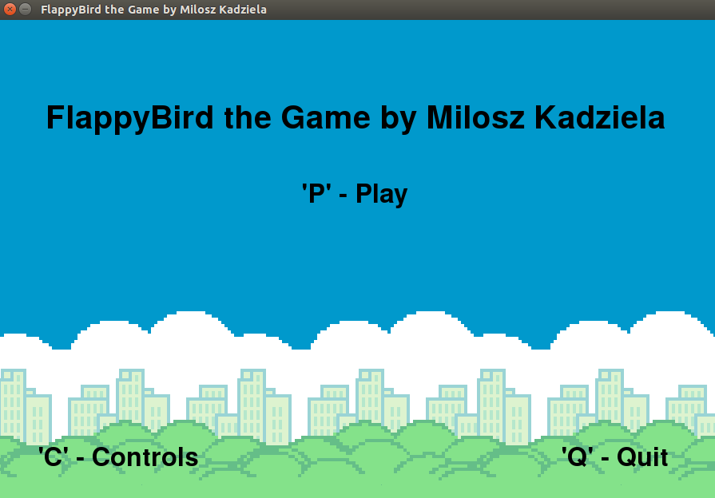
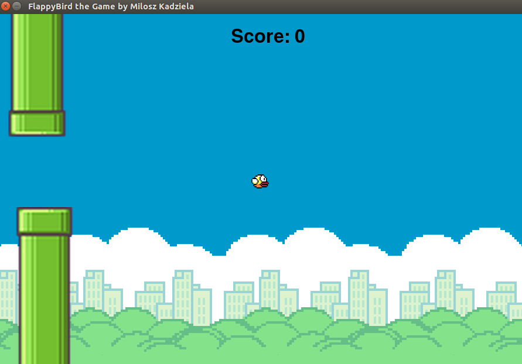

# FlappyBird the Game created in Python by Milosz Kadziela

## Description:
This is my version of a popular FlappyBird game. The aim of the game is to get the highest score possible before dying.

## Screenshots of the game:

## Prerequisites:
- Python 2
- Pygame (compatible with Python 2)

## How to set up:
1. Open Ubuntu terminal
2. Run the project `python FlappyBird-MK.py`

## Acknowledgements: 
- FlappyBird by dotGEARS
- Picture of pipes taken [from](http://www.palmentieri.it/flappyjam/pipe.png)
- Picture of bird taken [from](http://www.ellison.rocks/clumsy-bird/data/img/bg.png)